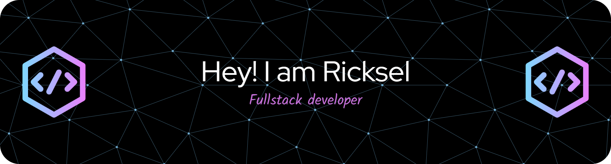

<h3 align="center">Aspiring Web Developer</h3>

---

🌱 I’m currently learning **JavaScript and React**

💻 I enjoy building web applications and exploring new technologies.

⚡ Fun fact: I’m still learning but I enjoy solving coding problems!

---

## 🚀 Skills & Technologies

---

## 📂 Projects

🔹 **MediClinic Capstone**  
A healthcare management system project.
[View My MediClinic Project](https://github.com/MediclinicCapstoneP/MediClinic_Repo.git)

🔹 **Job Allocation API**  
An API built using C# for managing job allocation.

🔹 **React First Project**  
My first project using ReactJS.

---

## 📫 Connect With Me

LinkedIn:  

---

⭐ *Thanks for visiting my GitHub profile!*
